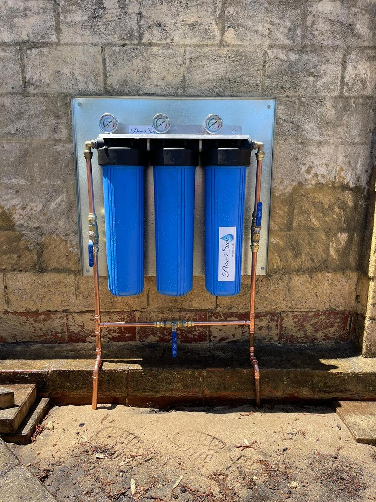

# Plumber Perth

<figure><figcaption>
A water filtration system installed by a plumber, Perth
</figcaption></figure>

When it comes to maintaining a home or managing a commercial property in Perth, a dependable plumbing system stands as a cornerstone of smooth operation. The city's rich tapestry of both aged and contemporary infrastructures requires a nuanced approach to plumbing—a task for seasoned professionals. This article dives into the [plumbing services available in Perth](https://dollarwise-plumbing-and-gas.business.site/), addressing common issues and providing guidance on selecting the most fitting service provider.

#### Understanding Perth's Plumbing Complexity

Perth presents a unique set of plumbing challenges, a mixture of historical and modern systems coexisting side by side. This blend requires a deep understanding of the varying demands of each property. Whether it's an iconic federation-style home or a sleek new commercial building, the plumbing needs can differ significantly, necessitating an experienced hand to manage them.

#### Common Plumbing Issues in Perth

Residents and businesses in Perth often encounter a range of plumbing problems:

* **Leaky Taps and Toilets:** A minor drip can lead to significantly increased water bills if not addressed promptly.
* **Blocked Drains and Pipes:** From root intrusions to foreign objects, blockages are a persistent nuisance.
* **Hot Water System Failures:** Essential for comfort and hygiene, these systems must operate flawlessly.
* **Burst Pipes:** A plumbing emergency that requires immediate attention to prevent extensive property damage.
* **Gas Plumbing Concerns:** With many homes powered by gas, safety and maintenance are paramount.

#### A Spectrum of Plumbing Services in Perth

Perth's plumbers are equipped to provide an extensive array of services, ensuring every aspect of your plumbing system functions optimally:

* **General Maintenance:** Regular checks and maintenance can preempt many common issues.
* **Drain Cleaning:** Professional plumbers offer expert solutions for keeping your drains clear and functional.
* **Leak Detection and Repair:** Utilising modern technology, plumbers can identify and rectify leaks efficiently.
* **Hot Water System Services:** From installation to repair, ensuring your hot water system is in peak condition is a priority.
* **Gas Services:** Certified professionals handle the installation and repair of gas lines and appliances, prioritising safety.
* **Renovation Services:** For those updating kitchens and bathrooms, skilled plumbers are crucial for the modernisation process.
* **Emergency Services:** Round-the-clock availability means help is always on hand for urgent issues.

#### The Importance of Professional Expertise

Choosing a professional plumber is not just a matter of service but also of safety, compliance, and peace of mind. In Perth, where the plumbing landscape is as varied as its architecture, the value of expertise cannot be overstated. Professional plumbers bring reliability, ensuring all work is in line with the stringent local standards and regulations.

#### Integrating with the Digital World

In today's digital era, many plumbing services in Perth have embraced online platforms to enhance their accessibility and efficiency. The following resources provide further insights and tools relevant to Perth's plumbing services:

* For a comprehensive spreadsheet on plumbing services: [Google Spreadsheet](https://docs.google.com/spreadsheets/d/1Ux2B4hEu\_uFXxEt2qbGIN9VM1cXpiauAKNX1RxNbv6o/edit?usp=sharing)
* Access to a publicly shared spreadsheet: [Google Docs Spreadsheet](https://docs.google.com/spreadsheet/pub?key=1Ux2B4hEu\_uFXxEt2qbGIN9VM1cXpiauAKNX1RxNbv6o)
* Detailed publication of services offered: [Google Sheets Publish](https://docs.google.com/spreadsheets/d/1Ux2B4hEu\_uFXxEt2qbGIN9VM1cXpiauAKNX1RxNbv6o/pubhtml)
* A viewable spreadsheet for service options: [Google Sheets View](https://docs.google.com/spreadsheets/d/1Ux2B4hEu\_uFXxEt2qbGIN9VM1cXpiauAKNX1RxNbv6o/view)
* Customer feedback and service request form: [Google Forms Feedback](https://docs.google.com/forms/d/1kgUtTEJRgZ2n2aARkbz8HodwEte-UkVhK9DQKkimcfI/edit?usp=sharing)
* Visual representations and diagrams of services: [Google Drawings Diagram](https://docs.google.com/drawings/d/1jOGZYHYo4iTw9u9qG9gN5hdOtPdLzCicNSepeH9RsrA/edit?usp=sharing)
* Accessible documentation and certifications: [Google Drive Documents](https://drive.google.com/file/d/1DpPO6uL9lwL6Be2snIKRkn\_F4G5IOPoP/view?usp=drivesdk)
* For local plumbing services, visit:[Dollarwise Plumbing and Gas](https://dollarwise-plumbing-and-gas.business.site/)

#### Conclusion

Navigating the plumbing industry in Perth can be complex, but with the right information and a professional at your call, even the most daunting tasks become manageable. Whether you’re facing an immediate crisis or planning preventative maintenance, Perth’s plumbing professionals are well-equipped to provide the services you need. With the integration of online resources, finding the right help is easier than ever. Remember, when it comes to plumbing in Perth, expertise is just a click away.
